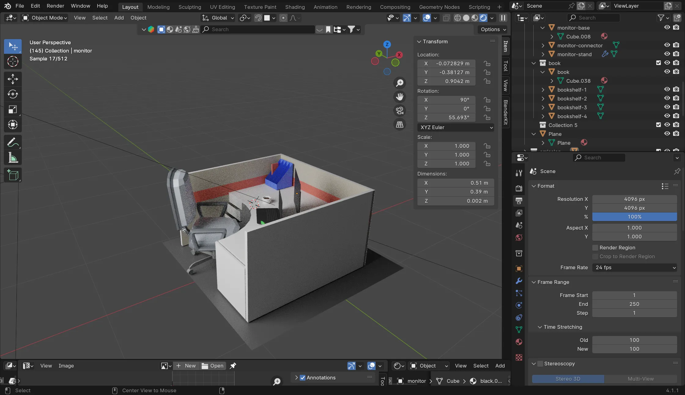
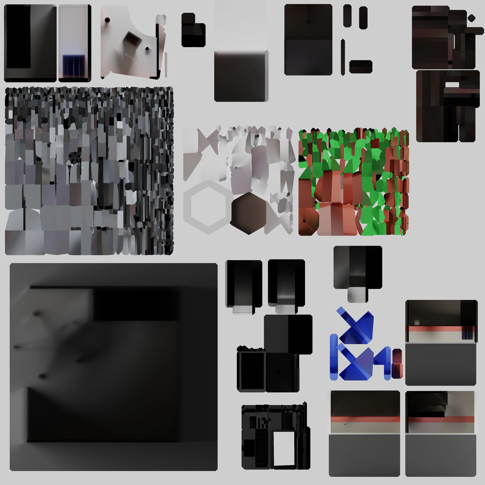
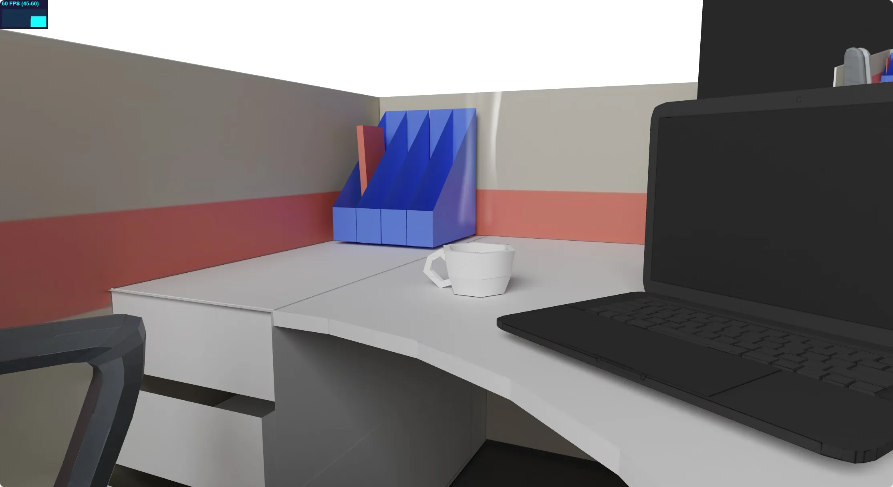
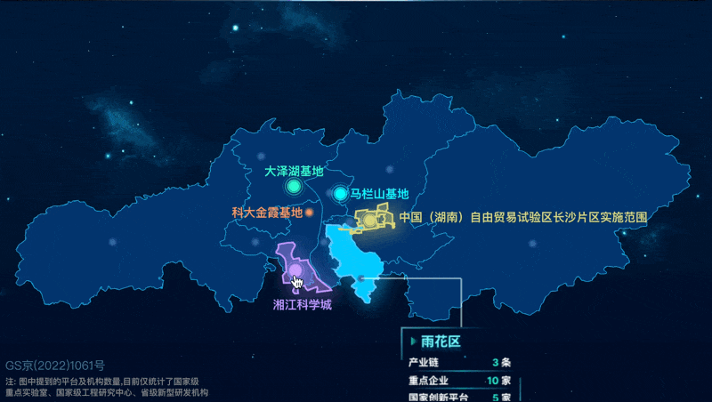
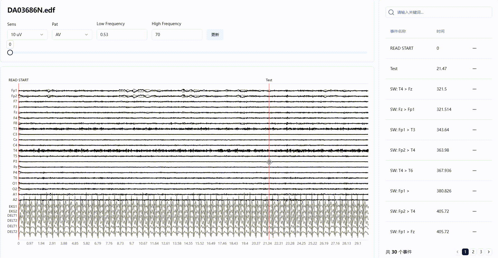

## 智慧园区

负责办公场景的建模和前端 Three.js 交互部分。

[网站](https://my-desktop-nine.vercel.app/)

Blender 建模

纹理烘焙

烟雾特效

## B 端可视化系统

使用 Echarts 创建一些列地图动态效果，如：飞线图、渐入渐出等等。

地图动效

## EEG-X 人工智能脑电分析平台

负责了 v1.0 版本的前端开发，使用 Echarts 来绘制脑电波形图，并集成了打点、数据转换等功能。

脑电平台

