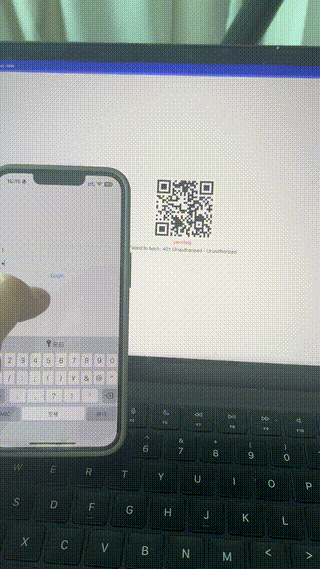
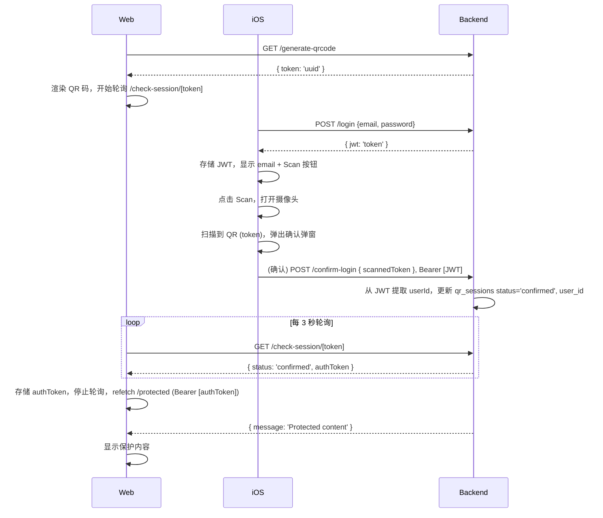

一个极简的二维码扫码登录系统

[GitHub](https://github.com/hidaviddong/qrcode-login)

Demo

```mermaid
sequenceDiagram
    participant Web
    participant iOS
    participant Backend

    Web->>Backend: GET /generate-qrcode
    Backend-->>Web: { token: 'uuid' }
    Web->>Web: 渲染 QR 码，开始轮询 /check-session/[token]

    iOS->>Backend: POST /login {email, password}
    Backend-->>iOS: { jwt: 'token' }
    iOS->>iOS: 存储 JWT，显示 email + Scan 按钮

    iOS->>iOS: 点击 Scan，打开摄像头
    iOS->>iOS: 扫描到 QR (token)，弹出确认弹窗
    iOS->>Backend: (确认) POST /confirm-login { scannedToken }, Bearer [JWT]
    Backend->>Backend: 从 JWT 提取 userId，更新 qr_sessions status='confirmed', user_id

    loop 每 3 秒轮询
        Web->>Backend: GET /check-session/[token]
        Backend-->>Web: { status: 'confirmed', authToken }
    end
    Web->>Web: 存储 authToken，停止轮询，refetch /protected (Bearer [authToken])
    Backend-->>Web: { message: 'Protected content' }
    Web->>Web: 显示保护内容
```

流程图

